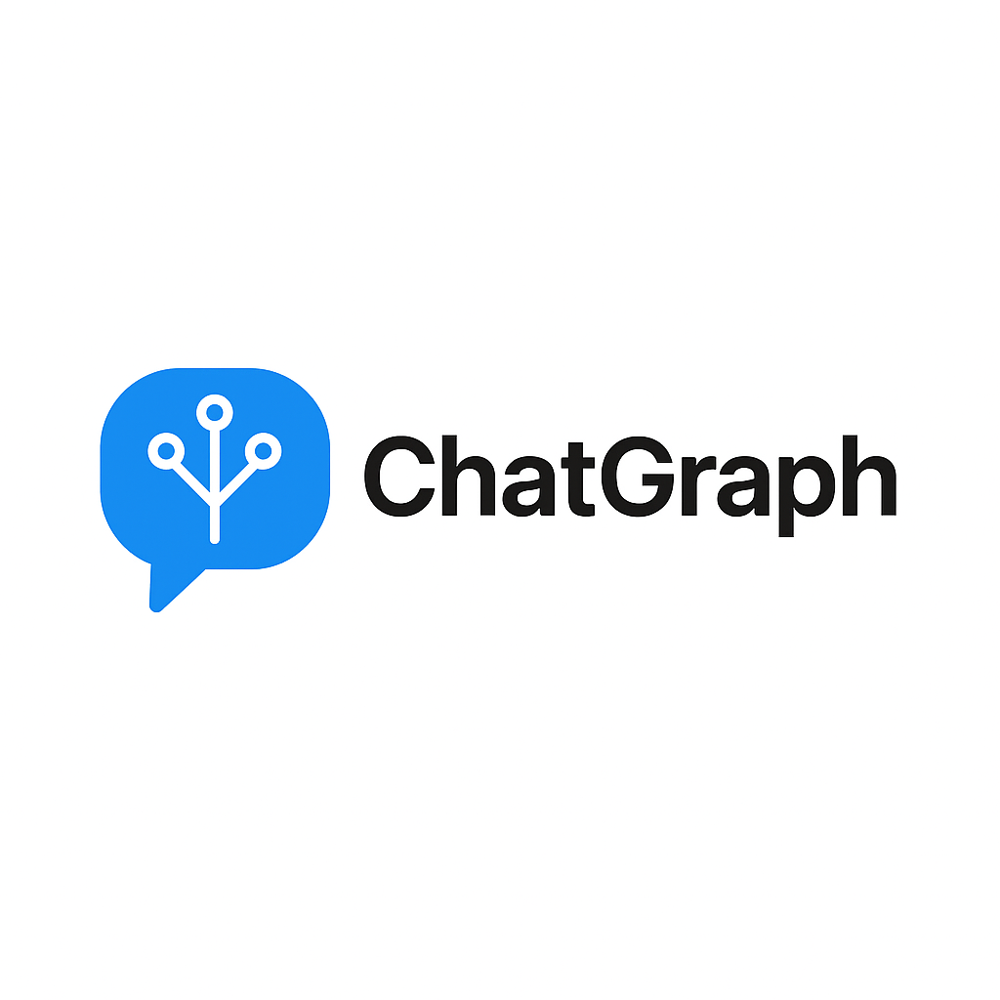

# Welcome to ChatGraph
An issue that is ubiquitous among AI chatbots is the way that they handle context in long conversations. No matter how optimized their context handling, the more your discussion expands, the more muddled the original point becomes in their window. ChatGraph seeks to solve this issue. 

Rather than trying to focus on expanding the size of the context window to prevent lossy information, ChatGraph enables the user to create branches of the conversation, separate from the original. This approach provides the chatbot with a memory of the initial conversation, and the user with the ability to go off on tangents without worry of losing a well tailored chat. 

## Important Startup Details

Below is a guide to start up and run ChatGraph as if it were your own. 
 - Clone the codebase from here
   - https://github.com/omcglynn/ChatGraph 
 - In order for it to function effectively, you will need to ensure that you have the relevant information in the **.env** files. 
   - Create a Supabase account, create a project and a database, and then use the SQL schema you downloaded to make your tables
   - Don’t forget to turn on row-level-security for all tables. 
   - Create an OpenAI developers account and get yourself an API key
   - Using the format in the “example.env” files, make “.env” files in the same directory utilizing the relevant information you just created :)
 - Open a terminal in the root directory of the codebase and run “npm install”
 - Run “npm run start”
 - ChatGraph should now be running in your machine! Navigate to localhost:5177 in your browser (or whatever port it is set to after running the start command) and start chatting!
